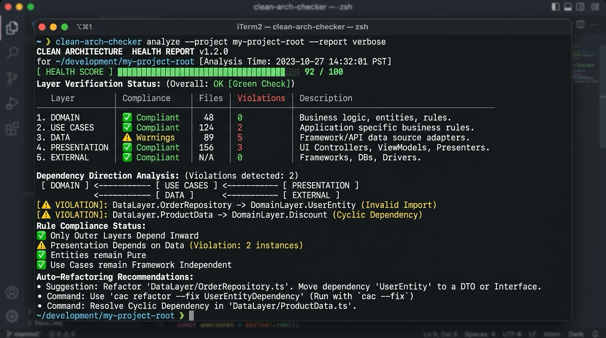

🇰🇷 [한국어](README.md) | 🇺🇸 [English](README.en.md) | 🇯🇵 [日本語](README.ja.md) | 🇨🇳 [中文](README.zh.md)

<p align="center">
  
</p>

<h1 align="center">🛡️ Clean Architecture Checker Skill</h1>

<p align="center">
  An AI Agent skill package to audit and enforce Clean Architecture and DIP rules across iOS, Android, Flutter, and React Native codebases.
</p>

<p align="center">
  
</p>

## Features

* **Multi-Agent Support**: Compatible with Claude Code, Antigravity, Cursor, Codex, OpenCode, and Windsurf.
* **Auto-Detection**: Recognizes iOS, Android, Flutter, and React Native project layouts automatically.
* **Layer Purity Checks**: Detects invalid UI, DB, or network framework imports in the Domain layer.
* **Health Scoring & Auto-Refactor**: Generates 100-point architecture health scores with automated fixes.

## Installation

### Homebrew
```bash
brew tap mrKangHo/tap
brew install clean-arch-checker
```

### NPX
```bash
npx github:mrKangHo/clean-arch-checker
```
